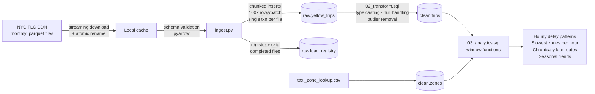

# NYC Transport Reliability Pipeline 🚕

A batch data pipeline that ingests NYC TLC Yellow Taxi trip records into Postgres and answers one question: **which routes are chronically unreliable, and when?**

**Stack:** Python 3.11+ · Postgres 16 · Docker Compose · pyarrow · SQLAlchemy

**Skills demonstrated:** containerized databases · idempotent batch ingestion · data cleaning at volume · window-function SQL analytics

## Architecture



**Three-layer design:**

| Layer | Table | Purpose |
|---|---|---|
| Registry | `raw.load_registry` | One row per source file — the idempotency ledger |
| Raw | `raw.yellow_trips` | Untouched landing zone, everything nullable, tagged with `source_file` |
| Clean | `clean.trips` | Typed, validated, with derived `duration_min` and `avg_speed_mph` |

## Key design decision: idempotency

Running the pipeline twice never duplicates data, guaranteed by three mechanisms:

1. **Load registry** — before loading a file, the script checks `raw.load_registry`. Status `completed` → skip. Status `failed`/`in_progress` (a crashed run) → delete that file's raw rows and reload from scratch.
2. **One transaction per file** — either the entire month commits or none of it. A crash mid-load leaves zero raw rows behind.
3. **Delete-then-insert transforms** — `02_transform.sql` deletes a file's clean rows before re-inserting, so re-running the transform is safe.

Proof from the logs of a repeat run:

```
INFO | SKIP yellow_tripdata_2024-01.parquet — already loaded (idempotency).
INFO | SKIP yellow_tripdata_2024-02.parquet — already loaded (idempotency).
```

## Data quality gates (raw → clean)

The TLC data is genuinely messy. The transform rejects rows with:

- Negative or zero durations (dropoff timestamp before pickup — these exist in the real data)
- Durations under 1 minute or over 4 hours
- Zero or >100 mile distances (GPS glitches)
- Implied speeds over 90 mph
- Location IDs outside the valid 1–265 range
- Negative total amounts

## Results

<!-- ─────────────────────────────────────────────────────────────
     REPLACE THE SAMPLE TABLES BELOW WITH YOUR REAL OUTPUT.
     Generate it with:
       Get-Content sql/03_analytics.sql -Raw | docker exec -i taxi_postgres psql -U taxi -d taxi | Out-File results.txt
     Then paste the relevant rows into each section and delete this comment.
     The numbers below are ILLUSTRATIVE examples of the expected shape.
     ───────────────────────────────────────────────────────────── -->

*Data analyzed: yellow taxi trips for 2024-01 and 2024-02 (~6M raw rows → ~5.8M clean rows after quality gates).*

### 1. When is the city slowest?

Average trip duration by pickup hour vs. the daily average:

```
 pickup_hour | trips  | avg_duration_min | avg_speed_mph | delta_vs_daily_avg
-------------+--------+------------------+---------------+--------------------
          17 | ______ |           ______ |        ______ |             +_____
          18 | ______ |           ______ |        ______ |             +_____
           5 | ______ |           ______ |        ______ |             -_____
```

**Finding:** _(e.g. "Evening rush 17:00–18:00 adds ~X minutes over the daily average; the fastest window is 04:00–05:00.")_

### 2. Which zones are chronically congested?

Five slowest pickup zones per hour by median speed (100+ trip minimum). Sample of the busiest hour:

```
 pickup_hour | borough   | zone            | trips | median_speed_mph | slowness_rank
-------------+-----------+-----------------+-------+------------------+---------------
          17 | Manhattan | _______________ | _____ |            _____ |             1
          17 | Manhattan | _______________ | _____ |            _____ |             2
```

**Finding:** _(e.g. "Midtown zones hold the bottom 5 speed rankings for every hour between 08:00 and 19:00.")_

### 3. Which routes are chronically unreliable? (flagship result)

Routes where the largest share of trips run 25%+ over that route's own median duration (200+ trip minimum):

```
 pickup_zone      | dropoff_zone     | trips | median_min | pct_trips_25pct_over_median | chronic_rank
------------------+------------------+-------+------------+-----------------------------+--------------
 ________________ | ________________ | _____ |      _____ |                       _____ |            1
 ________________ | ________________ | _____ |      _____ |                       _____ |            2
```

**Finding:** _(e.g. "The least predictable routes are airport runs — X% of JFK-bound trips from Midtown exceed their median by 25%+.")_

> **Why this metric:** taxis have no schedule, so there is no true "delay." Reliability is proxied as deviation from a route's own median — a route that's *always* 40 minutes is slow but dependable; one that's usually 15 but frequently 25 is what actually ruins commutes. A v2 using GTFS transit feeds would measure scheduled-vs-actual delay directly.

### 4. Seasonal trend

```
   month    | trips  | avg_duration_min | moving_avg_3mo | mom_change
------------+--------+------------------+----------------+------------
 2024-01-01 | ______ |           ______ |         ______ |
 2024-02-01 | ______ |           ______ |         ______ |     ______
```

**Finding:** _(fill in after loading 3+ months for the moving average to be meaningful)_

## Quickstart

```bash
# 1. Configure (edit .env with your own credentials)
cp .env.example .env

# 2. Start Postgres + pgAdmin (schema auto-applies on first boot)
docker compose up -d

# 3. Install Python deps
python -m venv .venv
source .venv/bin/activate        # Windows: .venv\Scripts\activate
pip install -r requirements.txt

# 4. Ingest (start with one month; ~3M rows)
python ingestion/ingest.py --months 2024-01

# 5. Prove idempotency — run it again, watch it skip
python ingestion/ingest.py --months 2024-01

# 6. Run the analytics
# bash / CMD:
docker exec -i taxi_postgres psql -U taxi -d taxi -f /dev/stdin < sql/03_analytics.sql
# PowerShell:
Get-Content sql/03_analytics.sql -Raw | docker exec -i taxi_postgres psql -U taxi -d taxi
```

pgAdmin: http://localhost:8080 — register a server with host `postgres`, port `5432`, and the credentials from your `.env`.

## Analytics techniques

| Query | Question | Techniques |
|---|---|---|
| Q1 | How does duration vary by hour vs. the daily average? | `AVG() OVER ()` empty-frame window |
| Q2 | Which 5 pickup zones are slowest at each hour? | `PERCENTILE_CONT`, `RANK() OVER (PARTITION BY ...)` |
| Q3 | Which routes are chronically late? | Median-per-route CTE + `DENSE_RANK()` |
| Q4 | Are trips getting slower month over month? | `ROWS BETWEEN 2 PRECEDING` moving average, `LAG()` |

## Project layout

```
nyc-taxi-pipeline/
├── docker-compose.yml        # Postgres 16 + pgAdmin, auto-applies schema
├── .env.example              # template — real .env is gitignored
├── requirements.txt
├── ingestion/
│   └── ingest.py             # download → validate → chunked load → transform
└── sql/
    ├── 01_schema.sql         # raw + clean schemas, registry, indexes
    ├── 02_transform.sql      # data quality gates, parameterized per file
    └── 03_analytics.sql      # 4 window-function analyses
```

## Roadmap

- Partition `clean.trips` by month once data exceeds ~50M rows
- Swap `to_sql` inserts for Postgres `COPY` (~10x load speedup)
- Orchestrate with Airflow; move transforms to dbt with schema tests
- v2: GTFS transit feeds for true scheduled-vs-actual delay

## Author

**Haider Ali Awan** — AI Engineer & Data Engineering
[GitHub](https://github.com/HaiderAli-Awan) · [LinkedIn](https://linkedin.com/in/haideraliawan)
